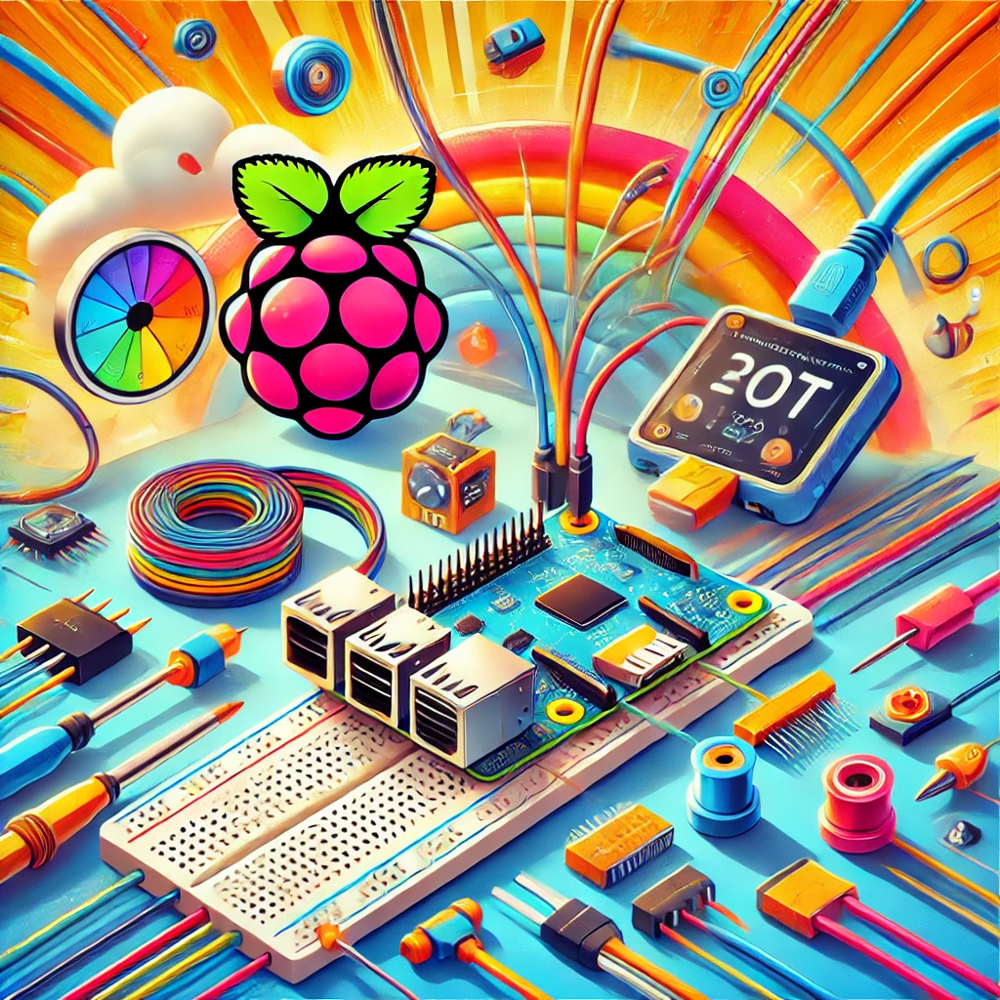
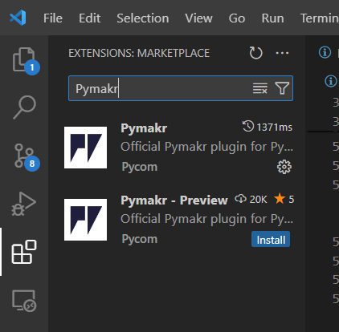
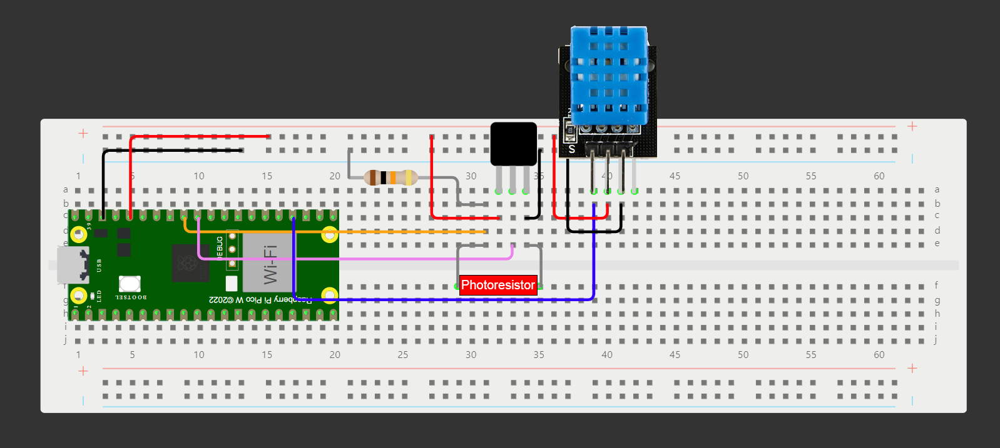

<h1 align="center">Self hosted IoT Temperature and Light level monitor</h1>

  

  By: <a href="https://github.com/dwov">David P.</a> - Student ID: dp222nr

## Overview
This is a IoT project for the course *Introduction to Applied IoT* at *Linnaeus University*.  

The goal of this project is to monitor temperature, humidity, and light levels in a room, with a potential future goal of automating my existing smart home. The project utilizes a Raspberry Pi Pico with two temperature sensors (one analog and one digital) and a photoresistor. The device will take readings every 10 seconds and send to a locally hosted MQTT broker and displayed with NODE-RED, alternatively only using Adafruit IO (easy mode).

Q: **How much time will this take to make?**  
A: Approximately 5-6 hours

## Objective
### Why did I choose this project?
Great question!  
I wanted a way to monitor the environment in my apartment, and in the future, even automate my current smart home where I have some smart appliances like bulbs and fan. I want to be even lazier than to speak to my Google Assistant asking it to toggle the lights or turn on/off the fan. This led me to create this project that could provide necessary data to automate my life.

### Project purpose
I've mentioned this already, but I also wanted to explore and familiarize myself with the basics of IoT, IoT communications, and DIY projects at home. Since starting this course/project, I've come up with interesting ideas for future projects. Stay tuned for updates on GitHub!

### Project insights
This project and course have provided new knowledge about basic IoT concepts and connectivity. It also came with challenges, particularly in server-side setup, but has been a rewarding experience.

## Material
### List of Material Needed, Including Description, Price, and Where to Buy

**Disclaimer:** The materials used in this project were purchased as part of the [Start Kit - Applied IoT at Linnaeus University](https://www.electrokit.com/lnu-starter). Not all components are used, so here are the essentials.

| Image | Description | Where | Price |
| ------------- | ------------- | ------------- | ------------- |
|  | Raspberry Pi Pico WH | [electrokit](https://www.electrokit.com/raspberry-pi-pico-wh) | 109 SEK |
|  | Breadboard | [electrokit](https://www.electrokit.com/kopplingsdack-840-anslutningar) | 69 SEK |
|  | Jumper wire M/M | [electrokit](https://www.electrokit.com/labbsladd-20-pin-15cm-hane/hane) | 29 SEK |
|  | Photoresistor | [electrokit](https://www.electrokit.com/fotomotstand-cds-4-7-kohm) | 8 SEK |
|  | MCP9700 | [electrokit](https://www.electrokit.com/mcp9700-to-92-temperaturgivare) | 12 SEK |
|  | DHT11 | [electrokit](https://www.electrokit.com/digital-temperatur-och-fuktsensor-dht11) | 49 SEK |
| Micro-USB | Cable | Anywhere |  |

\* All prices adjusted as of 2024-06-30 

- **Raspberry Pi Pico WH:** A microcontroller board based on the Raspberry Pi Foundation's RP2040 chip, providing a cost-effective and powerful solution for IoT projects.
- **Breadboard:** A reusable solderless prototyping board that allows for easy circuit experimentation and component connections.
- **Jumper wire M/M:** Male-to-male jumper wires for connecting components on a breadboard or other prototyping platforms.
- **Photoresistor:** A light-sensitive resistor that changes its resistance based on the intensity of light.
- **MCP9700:** A temperature sensor that provides analog output proportional to the temperature.
- **Micro-USB Cable:** A standard cable used for connecting devices with a micro-USB port.

## Computer setup
How is the device programmed. Which IDE are you using. Describe all steps from flashing the firmware, installing plugins in your favorite editor. How flashing is done on MicroPython. The aim is that a beginner should be able to understand.

- Chosen IDE
- How the code is uploaded
- Steps that you needed to do for your computer. Installation of Node.js, extra drivers, etc.
#

### Getting Started
To develop and run the code on the Raspberry Pi Pico on a Windows computer using Visual Studio Code, do these steps:
1. **Download and Install [Node.js LTS](https://nodejs.org/en/)**
2. **Download and Install [Visual Studio Code](https://code.visualstudio.com/Download)**
3. **Download and Install Pymakr**

4. **Flash MicroPython firmware onto Raspberry Pi Pico WH**
- Download the latest MicroPython firmware [here](https://micropython.org/download/rp2-pico-w).
- While holding the **BOOTSEL** button, connect your Raspberry Pi Pico WH to the computer. When plugged in, button can be released.
- A new drive should pop-up in file manager called **RPI-RP2**, copy and paste the firmware-file there.
- The device should now automatically disconnect from your computer.
- Replug the USB cable (without holding the BOOTSEL button). And voila!

data

- **Node.js:** I Have No Clue
- **Visual Studio Code (VS Code):** A powerful editor for writing all sorts of code, but in this case writing and running MicroPython code on the Raspberry Pi Pico.
- **Pymakr Extenstion:** An extenstion for VS Code that allows you to interact with MicroPython devices.
- **MicroPython Firmware:** The firmware that enables Python programming on microcontroller boards like the Raspberry Pi Pico.

### Step-by-Step
**NOTE:** I will only go over how I setup this with Windows 11, will update in the future if there is interest.

## Putting everything together
How is all the electronics connected? Describe all the wiring, good if you can show a circuit diagram. Be specific on how to connect everything, and what to think of in terms of resistors, current and voltage. Is this only for a development setup or could it be used in production?

- Circuit diagram (can be hand drawn)
- *Electrical calculations
#

## Chosen platform
Describe your choice of platform. If you have tried different platforms it can be good to provide a comparison.
Comment

Is your platform based on a local installation or a cloud? Do you plan to use a paid subscription or a free? Describe the different alternatives on going forward if you want to scale your idea.

- Describe platform in terms of functionality
- *Explain and elaborate what made you choose this platform

## The code
Import core functions of your code here, and don't forget to explain what you have done! Do not put too much code here, focus on the core functionalities. Have you done a specific function that does a calculation, or are you using clever function for sending data on two networks? Or, are you checking if the value is reasonable etc. Explain what you have done, including the setup of the network, wireless, libraries and all that is needed to understand.

## Data transmission and connectivity
How is the data transmitted to the internet or local server? Describe the package format. All the different steps that are needed in getting the data to your end-point. Explain both the code and choice of wireless protocols.

- How often is the data sent?
- Which wireless protocols did you use (WiFi, LoRa, etc …)?
- Which transport protocols were used (MQTT, webhook, etc …)
- *Elaborate on the design choices regarding data transmission and wireless protocols. That is how your choices affect the device range and battery consumption.

## Data presentation
Describe the presentation part. How is the dashboard built? How long is the data preserved in the database?

- Provide visual examples on how the dashboard looks. Pictures needed.
- How often is data saved in the database.
- *Explain your choice of database.
- *Automation/triggers of the data.

## Finalizing the design
Show the final results of your project. Give your final thoughts on how you think the project went. What could have been done in an other way, or even better? Pictures are nice!

- Show final results of the project
- Pictures
- *Video presentation
