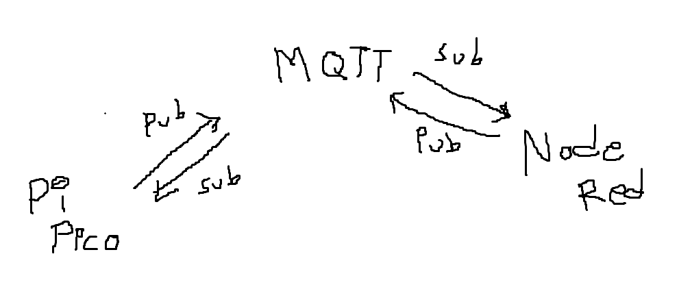
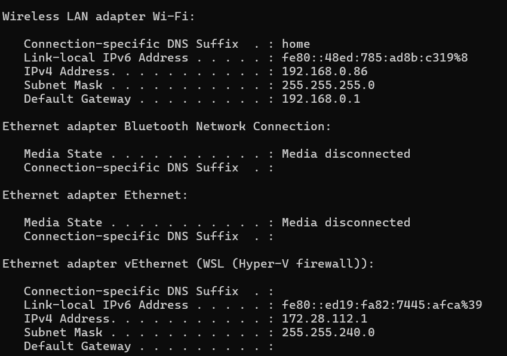
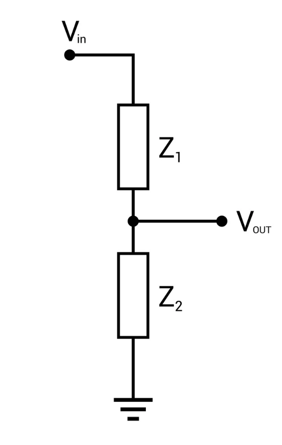
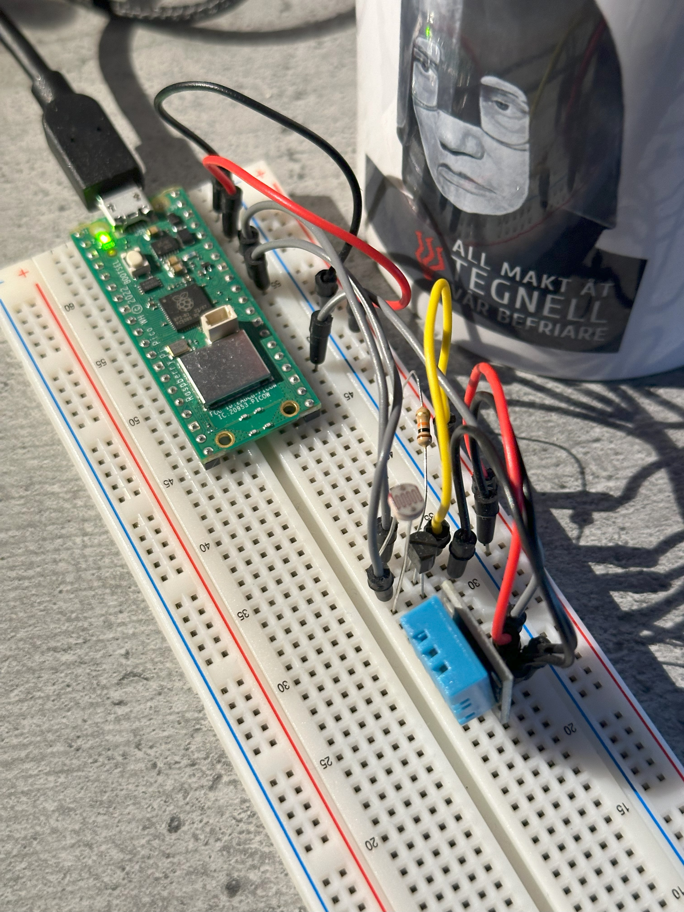
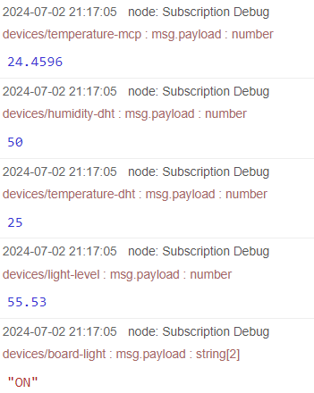
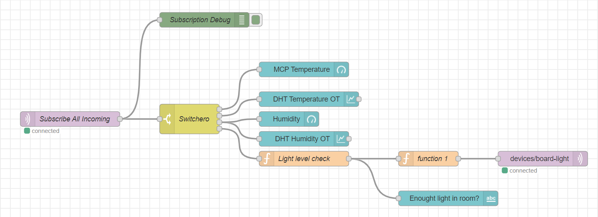
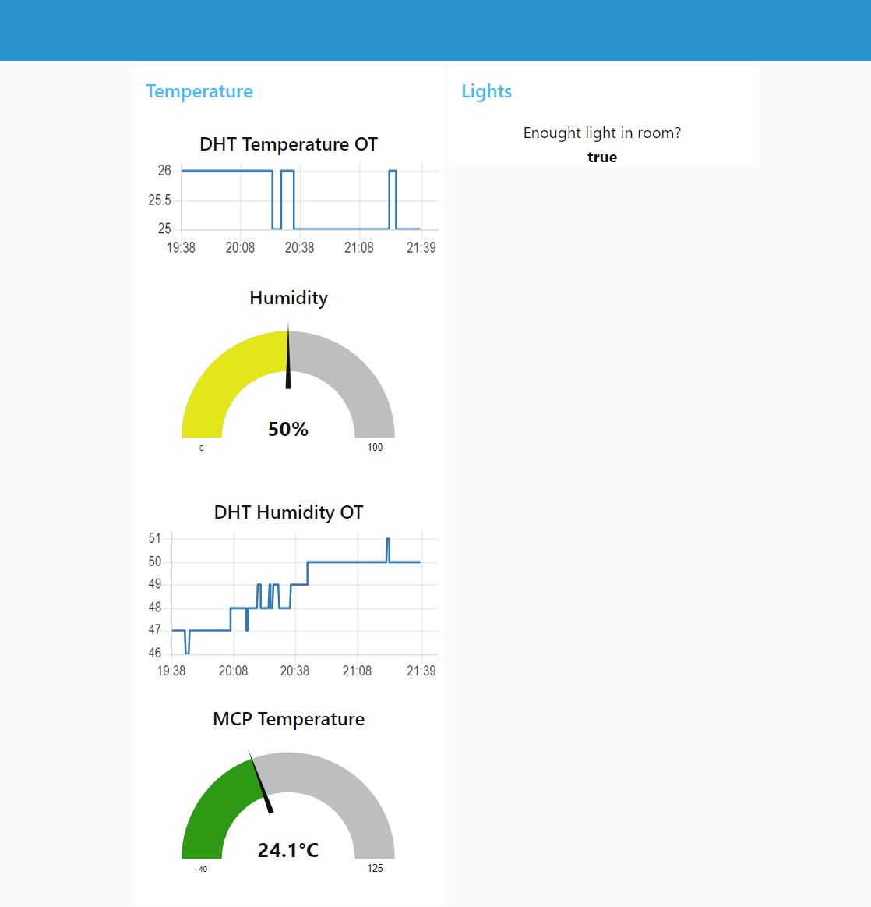

<h1 align="center">SmartEnv: IoT Temperature and Light Monitor</h1>

<p align="center">
  
  <br>Image generated with DALL*E
</p>

<p align="center">
  By: <a href="https://github.com/dwov">David Permlid</a> - Student ID: dp222nr
</p>

# Introduction
This project was created as part of the course *[Introduction to Applied IoT](https://lnu.se/en/course/introduction-to-applied-internet-of-things/distance-international-summer/)* at *Linnaeus University*.

The purpose of this project is to create the base for my fully automated smart home, with this prototype being a monitoring system that handles temperature, humidity, and light levels in a room. With this proof of concept, I will be able to expand and implement different solutions later on, using my newly acquired knowledge, to achieve a truly smart home.

This project utilizes a Raspberry Pi Pico WH with some sensors wired up to read and send data to an **MQTT** Broker, hosted locally on a computer of choice, where the data will then be displayed in **Node-RED**.

Q: **How much time will this take to make?**  
A: Approximately 5-8 hours

## System communication overview

This image shows a very basic system overview, displaying how the system communicates.

# Table of contents
- [Introduction](#introduction) - A brief introduction.
- [Objective](#objective) - The overall goal of the project.
- [Materials](#materials) - The components used.
- [Computer Setup](#computer-setup) - Setting up your environment and getting started with everything server-side.
  - [Programming the Raspberry Pi Pico WH](#programming-the-raspberry-pi-pico-wh) - Setting up the IDE and Pi Pico W development.
  - [Setting up Ubuntu to Run Mosquitto MQTT Server](#setting-up-ubuntu-to-run-mosquitto-mqtt-server) - Setting up the Ubuntu server and getting Mosquitto MQTT and Node-RED running.
    - [Ubuntu Regular Mosquitto Setup](#ubuntu-regular-mosquitto-setup) - Setting up Ubuntu on a dedicated computer.
    - [Ubuntu WSL Mosquitto Setup](#ubuntu-wsl-mosquitto-setup) - Setting up Ubuntu running in a virtual environment on Windows 11.
- [Putting Everything Together](#putting-everything-together)
- [Chosen Platform](#chosen-platform)
- [The Code](#the-code)
- [Data Transmission and Connectivity](#data-transmission-and-connectivity)
  - [Node-RED Backend](#node-red-backend)
- [Data Presentation](#data-presentation)
- [Finalizing the Design](#finalizing-the-design)
  - [Future Improvements to be Made](#future-improvements-to-be-made)

# Objective
The Goal: Monitor and Automate My Apartment

It's been a long-time dream of mine to have an automatic home environment where everything just does what it should at will, where I have complete control and don't have to rely on a constant Internet connection. The bigger goal listed above is a long-term commitment. With this project, I aim to monitor the environment in my apartment to gather data and concepts that can further improve my living space. I chose a locally self-hosted solution to increase security and avoid the limitations of free versions of cloud services like *Adafruit*, but also to not solely rely on a constant internet connection (like my Google Home). The project provided me an opportunity to delve into IoT technologies and hands-on DIY projects like I've had in mind for a while.

Exploring IoT basics, communications, and home automation has always intrigued me, but I never had the push to start. This course kickstarted my journey, sparking various ideas for future projects.  
*Stay tuned for updates on GitHub!*

This project will provide me with new knowledge and ideas about IoT concepts, IoT connectivity, and self-hosting, which I always found intimidating and difficult to set up. The course and project will also help me advance in my career in embedded systems, IoT, and DIY tinkering.

# Materials
## Bill of Materials

***Disclaimer:*** The materials used in this project were purchased as part of the [Start Kit - Applied IoT at Linnaeus University](https://www.electrokit.com/lnu-starter). Not all components are used, so here is a list of the important ones for this specific project:

| Image | Description | Where | Price |
| ------------- | ------------- | ------------- | ------------- |
|  | Raspberry Pi Pico WH | [electrokit](https://www.electrokit.com/raspberry-pi-pico-wh) | 109 SEK |
|  | Breadboard | [electrokit](https://www.electrokit.com/kopplingsdack-840-anslutningar) | 69 SEK |
|  | Jumper wire M/M | [electrokit](https://www.electrokit.com/labbsladd-20-pin-15cm-hane/hane) | 29 SEK |
|  | Photoresistor | [electrokit](https://www.electrokit.com/fotomotstand-cds-4-7-kohm) | 8 SEK |
|  | MCP9700 | [electrokit](https://www.electrokit.com/mcp9700-to-92-temperaturgivare) | 12 SEK |
|  | DHT11 | [electrokit](https://www.electrokit.com/digital-temperatur-och-fuktsensor-dht11) | 49 SEK |
|  | 10kΩ Resistor | Electronics store |  |
|  | Micro-USB Cable | Anywhere |  |

\* All prices adjusted as of 2024-06-30 

### Short Component Description
- **Raspberry Pi Pico WH:** A microcontroller board based on Raspberry Pi's RP2040 chip, providing a cost-effective solution for DIY IoT projects. It also features Wi-Fi and Bluetooth connectivity.
- **Breadboard:** A reusable solderless prototyping board that allows for easy circuit experimentation and component connections.
- **Jumper wire M/M:** Male-to-Male jumper wires for connecting components on the breadboard.
- **Photoresistor:** A light-sensitive resistor that changes its resistance based on the intensity of light.
- **MCP9700:** A temperature sensor that provides analog output (voltage) proportional to the temperature.
- **DHT11:** A temperature and humidity sensor that provides digital output (i.e., 1's and 0's).

# Computer Setup

## Programming the Raspberry Pi Pico WH
To develop and run the code on the Raspberry Pi Pico, specifically on a Windows computer (I don't have access to other operating systems at this moment) using Visual Studio Code, you will need to:
1. **Download and Install [Node.js LTS](https://Nodejs.org/en/)**
2. **Download and Install [Visual Studio Code](https://code.visualstudio.com/Download)** - Thonny IDE is another great option, but due to familiarity and experience with other projects in Visual Studio Code, I opted for that.
3. **Download and Install Pymakr from extensions in VS Code**


4. **Flash MicroPython firmware onto Raspberry Pi Pico WH**
- Download the latest MicroPython firmware [here](https://micropython.org/download/rp2-pico-w). (At the time of this project, the latest firmware is v1.23.0)
- While holding the **BOOTSEL** button, connect your Raspberry Pi Pico WH to the computer. When plugged in, the button can be released.
- A new drive should pop-up in the file manager called **RPI-RP2**. Copy and paste the firmware file there.
- The device should now automatically disconnect from your computer.
- Replug the USB cable (without holding the BOOTSEL button). And voila!

If you have trouble setting things up or don't know how to start a project, I advise you to check the course's guides for [Installing VS Code and Pymakr](https://hackmd.io/@lnu-iot/rkiTJj8O9), [Updating firmware of Pi Pico W + Test run code](https://hackmd.io/@lnu-iot/rkFw7gao_#Visual-Studio-Code), and [Basic code structure](https://hackmd.io/@lnu-iot/B1T1_KM83).

Great, we are now ready to program our Pi Pico. If you want to experiment with running code, feel free to take a break here.

## Setting up Ubuntu to Run Mosquitto MQTT Server
***Disclaimer:*** I did not have access to a separate computer and did not want to install Linux as the main operating system, so I had to improvise. I knew that Windows 11 could run Linux in a virtual environment with [WSL](https://learn.microsoft.com/en-us/windows/wsl/). With that knowledge, I set it up on my laptop in a virtual Linux environment because I could not get Mosquitto MQTT to work directly on Windows.

*Side-note: If you want a simpler solution like Adafruit IO, you can skip this setup part and check out [this tutorial](https://hackmd.io/@lnu-iot/r1yEtcs55) on how to connect to Adafruit*

### Ubuntu Mosquitto Setup
The only difference between this and a normal OS installation is the installation part of 
**Install Ubuntu Server on your old laptop or a dedicated machine.**

   - Download the Ubuntu Server ISO from the official [website](https://ubuntu.com/download/server).
   - Create a bootable USB drive using software like Rufus or BalenaEtcher.
   - Boot your laptop or dedicated machine from the USB drive and follow the installation wizard to install Ubuntu Server.
   - Create an admin user and password.
   - Update the software package.
     ```powershell
     sudo apt update -y
     sudo apt upgrade -y
     ```

1. **Getting Setup with Ubuntu WSL**
    - Install WSL by following Microsoft's [guide](https://learn.microsoft.com/en-us/windows/wsl/install). Then install Ubuntu from the [Microsoft Store](https://www.microsoft.com/store/productId/9PDXGNCFSCZV?ocid=pdpshare).
    - Launch Ubuntu and a Terminal window should pop up, prompting you to create an admin user. When successful, make sure to update the software package.
    ```shell
    $ sudo apt update -y
    $ sudo apt upgrade -y
    ```
2. **Installing Mosquitto MQTT Broker**
    - In the Ubuntu terminal window, type:
    ```shell
    $ sudo apt install -y mosquitto mosquitto-clients
    ```
    - Enable autostart at boot.
    ```shell
    $ sudo systemctl enable mosquitto
    ```
    - Check Mosquitto version and support.
    ```shell
    $ sudo mosquitto -h
    ```
    - You can start Mosquitto with either
    ```shell
    $ sudo systemctl start mosquitto
    "or"
    $ sudo mosquitto
    ```
    We will use the latter one with some flags to specify a config file and run it in verbose mode (essentially a debug mode where it prints more information).
    - To do this, we will need a configuration file. I had trouble modifying the default configuration, so I created a new one in the conf.d file in the Mosquitto folder.  
    Let's create the file with:
    ```shell
    $ sudo touch /etc/mosquitto/conf.d/custom.conf
    "then type,"
    $ sudo nano /etc/mosquitto/conf.d/custom.conf
    "to edit the file."
    ```
    - In this file, we want to add these lines:
    ```shell
    listener 1883
    allow_anonymous true
    # The path to the usernames and passwords file
    password_file /etc/mosquitto/passwd
    # Give authorization access to specific topics to each user
    acl_file /etc/mosquitto/aclfile
    ```
    - Press Ctrl + X, then Ctrl + Y, and then ENTER to save and exit.
    - Now follow the [LNU tutorial](https://hackmd.io/@lnu-iot/rJr_nGyq5) for the rest of the setup since nothing is different.

3. **Install Node-RED**
    - Follow Node-RED's tutorial on how to install it on Windows [HERE](https://Nodered.org/docs/getting-started/windows). (It's a short and simple process)
    - Run Node-RED in a *Powershell* terminal window in Windows with the `node-red` command.

    **Alternatively, install Node-RED on the Ubuntu Server**

   - Install Node.js and npm:
     ```shell
     sudo apt install nodejs npm
     ```
   - Verify the Node.js and npm installations:
     ```shell
     node --version
     npm --version
     ```
   - Install Node-RED:
     ```shell
     sudo npm install node-red
     ```
   - Enable autostart at server boot:
     ```shell
     sudo systemctl enable nodered.service
     ```

4. **Connect Node-RED to Mosquitto MQTT**  
    When starting Node-RED, it should give you the address and port to use for configuration. Since we are running this on one machine, we can use `localhost` as our address, which simplifies things a lot (this is not the case later for the Pi Pico).
    - The default port is `1880`. Use this to open up Node-RED's configuration page by typing `localhost:1880` into your favorite browser's address bar.
    - Add an ``"mqtt-in"`` and a ``"Debug"`` node to your flow.
    - Follow [this guide](https://hackmd.io/@lnu-iot/rJr_nGyq5#Connecting-Node-Red-to-Mosquitto-MQTT-Broker) until you've finished step 5.

5. **Now to the fun part of making this work for the Pi Pico (!if running in WSL!)**  
    Here is where my struggle was for a long time. Since Mosquitto is running in a virtual environment, it has a virtual Ethernet adapter (Ethernet adapter vEthernet (WSL (Hyper-V firewall))). This is visible if you check `ipconfig` in a command prompt. As can be seen, this IPv4 address is not the same as our local network IPv4 address.
    
    
    
    To fix this, we need to link our IP address with a `portproxy`. [Visual guidance here](https://www.youtube.com/watch?v=yCK3easuYm4) from David Bombal on YouTube.
    - Open a terminal/powershell as admin and enter the following command:
    ```powershell
    netsh interface portproxy add v4tov4 listenport=1883 listenaddress=0.0.0.0 connectport=1883 connectaddress=172.28.112.X
    ```
    Change `connectaddress=X.X.X.X` to your virtual IPv4 address (most likely starting with 172.X.X.X, like mine).
    - Next, we need to allow traffic through our firewall. Open firewall settings from the control panel and go to "Advanced settings" and select "Inbound Rules".
    - Click "New Rule..." on the right-hand side, and choose "Port" and hit next.
    - Select "TCP" and enter `1883` in "Specific local ports:". Hit next.
    - Select "Allow the connection", hit next and select all (Domain, Private, Public).
    - Hit next and give it a name like `WSL 1883` so it's easy to remember and find.

# Putting Everything Together
Wiring everything up should be pretty straightforward. Ground to ground, positive to positive, and data or reading pins to one of the available `GPIO` pins on the Microcontroller.

**Be sure to read the datasheet for each component to be sure of what leg or pin goes where**

I had a 10kΩ resistor from the kit, which is good to use together with the photoresistor. We can calculate the voltage from the photoresistor with a simple voltage divider equation. This is mostly for safety and is most likely not needed.



$$V_{out} = V_{in} \times \frac{R_2}{R_1 + R_2},$$  

where:
- $( V_{out} )$ is the output voltage,
- $( V_{in} )$ is the input voltage,
- $( R_1 )$ and $( R_2 )$ are the resistances.

$$V_{out} = 3.3V \times \frac{R_{Photoresistor}}{10k + R_{Photoresistor}},$$

We want to connect it with a pull-down to increase reliability and accuracy of readings.

##
The final connections should look something like this (try and make it prettier than this :)).




Here is my spaghetti of a development board and all the little things connected.

# Chosen Platform
I started the project with my mind set on running everything on my TrueNAS server at my apartment. But since it's the summer, I am staying elsewhere and thus I initially went for Adafruit IO as my MQTT broker and visual provider.

While Adafruit was both easy to use and set up, I felt that I wanted to challenge myself a little more and also increase privacy and security, so I went for a local installation with a plan for the future to implement this at my home when autumn comes around the corner. I went for the MQTT platform from Mosquitto for packet transportation and Node-RED as my visualization. Compared to Adafruit, I have so much more freedom and customizability with Node-RED both in terms of functionality and looks.

With Node-RED, you can install additional modules and nodes which can further increase the functionality of the software. Did I mention, it's completely free! You are in charge of the data and functions.

# The Code
The code is written in MicroPython and serves the purpose of establishing a connection to Wi-Fi, the MQTT Broker, collecting sensor data, and transmitting the data to the MQTT broker. If unsuccessful with any connection, it will retry to connect with MQTT, and with Wi-Fi or other errors, reset the device after 20 seconds. Every loop, the microcontroller checks the connection to the internet and MQTT broker, sends the data to the MQTT server, and can also receive instructions (though these are not coded yet).

- `main.py` contains the core functionalities of collecting and sending data to the broker. Below is the main loop of the program:
```python
try:
    while 1:              # Repeat this loop forever
        if ((time.ticks_ms() - last_reconnect_ticks) > RECONNECT_INTERVAL): # Ensure we are connected to WiFi and reconnect MQTT
            wifiConnection.connect()
            client.disconnect()
            time.sleep(1)
            client.connect()
            client.subscribe(keys.MQTT_BOARD_LIGHT_FEED)
            last_reconnect_ticks = time.ticks_ms()
        
        client.check_msg()
        read_sensors()
except Exception as e:  # If an exception is thrown, print the error and reset the Pico to try and reconnect.
    print("An error occurred, {}".format(e))
    wifiConnection.disconnect()
    time.sleep(20)   # Wait 20 seconds before resetting
    machine.reset()  # Restart the Pico
finally:                  # If an exception is thrown disconnect from MQTT and WiFi
    client.disconnect()
    wifiConnection.disconnect()
    print("Disconnected from MQTT(NODE RED).")
```
- `lib/keys.py` stores the credentials and configurations related to Wi-Fi and MQTT.
- `lib/mqtt.py` provides the implementation of the MQTT client, sending and receiving data.
- `lib/wifiConnection.py` handles the Wi-Fi connection.

`mqtt.py` and `wifiConnection.py` were taken from the course GitHub [repo](https://github.com/iot-lnu/pico-w/tree/main).

# Data Transmission and Connectivity
The project uses a locally hosted MQTT broker, but it is possible to make it work over the internet with some further tinkering if wanted.

#
> MQTT is a lightweight messaging protocol designed for constrained devices (such as IoT devices) with low-bandwidth, high-latency, or unreliable networks in mind. It uses a PUBLISH-SUBSCRIBE model.  
> The minimum packet size of an MQTT message is 2 bytes, which means it's substantially smaller than an HTTP packet, which is a minimum of 26 bytes. This leads to less power consumed sending data.
#

The sensors' collected data is transmitted over Wi-Fi to the MQTT Broker using the MQTT protocol. I wanted to use MQTT over HTTP because of its lightweight and efficient messaging to keep power consumption low and reduce overhead, as mentioned above.

In this implementation, the messages are sent every 10 seconds to reduce unnecessary amounts of data being sent, but still keep it relatively real-time.

Messages received by the MQTT broker are forwarded to all subscribers, like the Node-RED client which receives the following:
<p align="center">

</p>
and then publishes the "ON" or "OFF" (seen last in the picture) message depending on if there is enough light in the room. (This is mostly a debug feature and to be easily changed later when implementing into Home Assistant.)

## Node-RED Backend


# Data Presentation
The visualization of data is done using the Node-RED dashboard, which can be easily installed from the Node-RED menu.

My representation looks like this for now:


# Finalizing the Design
I unfortunately did not have time or access to my dedicated home server and thus needed to compromise on automation. This has been bumming me out during the whole project, but I think I have something to further develop in the coming months. So to summarize, I would not say that the project is completely finished yet.

## Future Improvements to be Made
These are some of my thoughts to further improve the functionality and behavior of the project.

- Make the Pico restart code after a crash, if say the MQTT broker goes down. (Right now it will crash and stay there)
- Add deep sleep functionality to save power when not reading or sending data.
- Add some kind of data interval adjustment.
- Improve security.
- 3D print a case (I have a contact, but I am waiting for my turn).
- Make it connect to the MQTT broker running in TrueNAS and automate lights and fan in Home Assistant.
